# How to Break RSA and How PQC's Lattice based Algorithm Works, with Simplified Illustration

<br><br><br>

```
╔═╦═══════════════════════════════════════════════════════╦═╗
╠═╬═══════════════════════════════════════════════════════╬═╣
║ ║ Content of this Folder was Last Updated on 2026 03 11 ║ ║
╠═╬═══════════════════════════════════════════════════════╬═╣
╚═╩═══════════════════════════════════════════════════════╩═╝
```
<br><br><br>

This is the second of a two-parts article-series, for full context I recommend reading both articles.
The previous part is [TLS, RSA in High-Level Simplified Illustration](https://github.com/gjwdyk/Article-TLS-RSA-High-Level-Simplified-Illustration).
Some contexts of below discussions may refer to the context previously described at [TLS, RSA in High-Level Simplified Illustration](https://github.com/gjwdyk/Article-TLS-RSA-High-Level-Simplified-Illustration) section.
Example: the variable-names in Algorithms' formulas.

This part describes how Asymmetric Cryptography (i.e. RSA) can be broken using Quantum Computer, and also how PQC's Lattice based Algorithm (Learning with Errors Algorithm) works, in High-Level and Simplified Explanations, accompanied with Illustration to make reader grasp the understanding easier.

<br><br><br>

***

## Breaking RSA

Now that we understand how RSA Algorithm works (kindly refer to [RSA Algorithm](https://github.com/gjwdyk/Article-TLS-RSA-High-Level-Simplified-Illustration#rsa-algorithm) from previous article), let's try to understand the Algorithm to break RSA ***in an acceptable time requirement*** with the help of a Quantum Computer.

Breaking RSA involves three major steps:

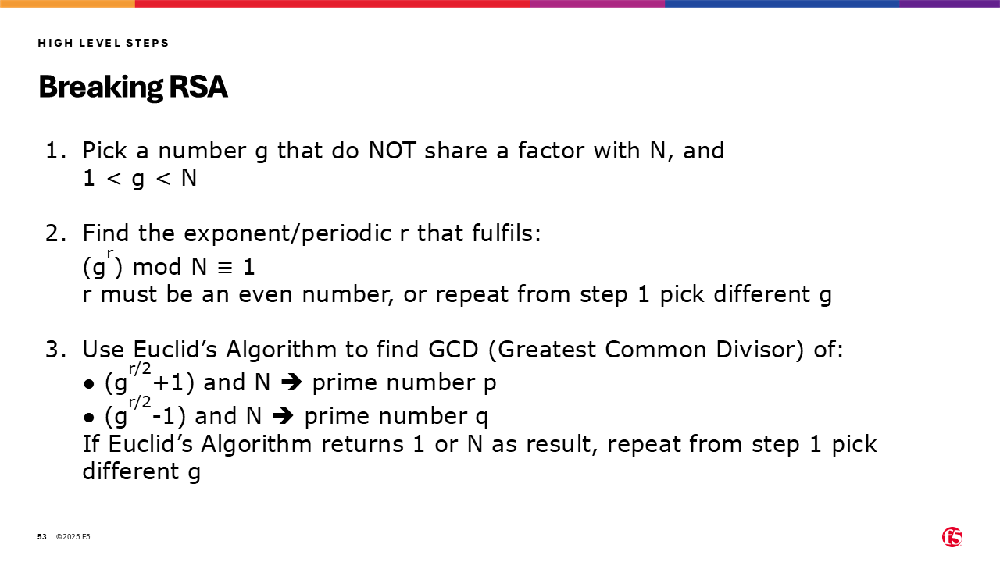

- [ ] Pick/guess a number $g$ that does NOT share any factor with $N$, and fulfils:

```math
{\color{red}1 < g < N}
```

- [ ] Find the periodic exponent $r$ that fulfils:

```math
{\color{red}(g^r) \bmod N \equiv 1}
```

If $r$ is found to be an odd number, restart from beginning and pick another/different $g$.
Continue to next step if $r$ is found to be an even number.

- [ ] Use Euclid's Algorithm to find GCD (Greatest Common Divisor) of:
  - [ ] ${\color{red}((g^{\frac{r}{2}}) + 1)}$ and ${\color{red}N}$   &nbsp; &nbsp; &nbsp; &#10230; &nbsp; &nbsp; &nbsp;   which result becomes RSA's Prime Number $p$
  - [ ] ${\color{red}((g^{\frac{r}{2}}) - 1)}$ and ${\color{red}N}$   &nbsp; &nbsp; &nbsp; &#10230; &nbsp; &nbsp; &nbsp;   which result becomes RSA's Prime Number $q$

If Euclid's Algorithm returns $1$ or $N$, restart from beginning and pick another/different $g$.

<br><br><br>

***

Now that we got the general steps, let's put some numbers to see and hopefully add more understanding to how those steps work:

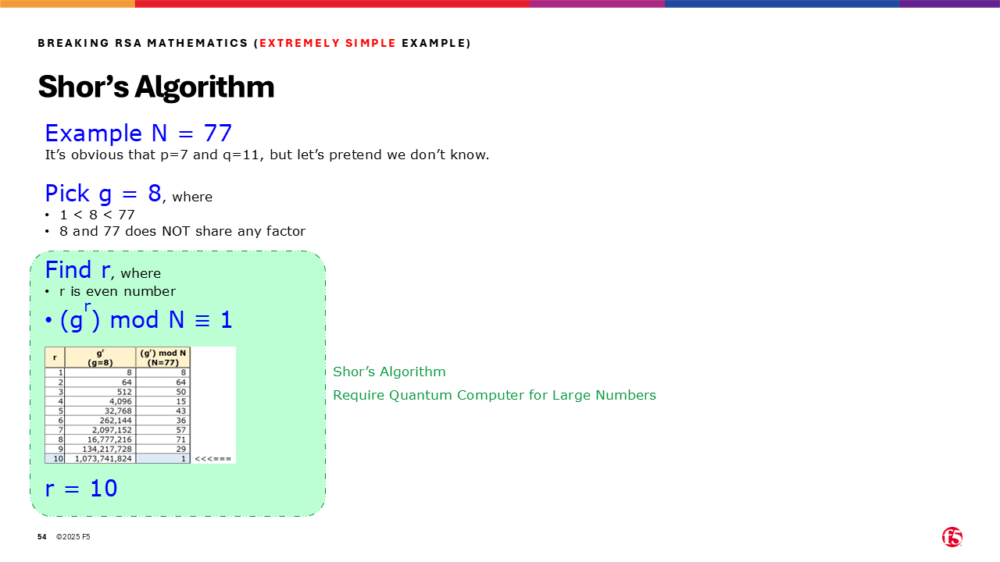

As per [RSA Algorithm](https://github.com/gjwdyk/Article-TLS-RSA-High-Level-Simplified-Illustration#rsa-algorithm),
we know that if we obtain a RSA Public Key (or SSL/TLS Certificate), in the Public Key (or SSL/TLS Certificate) there is $N$ (Modulus) and $e$ (Encryption Exponent) information, as per formula:
${\color{red}Public \  Key = (N, e)}$ .

As described in the above steps, we need to factorized Modulus $N$ back to the selected two prime-numbers $p$ and $q$ .

<br><br>

Let's take a better example specific for explaining the steps to break RSA clearer:<br>
${\color{red}N = 77}$<br>

Because the example number we select is small (instead of a 2048 bits long number), we can directly guess that the two $p$ and $q$ prime-numbers are: $7$ and $11$ .
However, let's pretend that we don't know, and test the steps and formulas to break RSA.

<br><br>

First step is to pick/guess a number $g$ that does NOT share any factor with $N$, and fulfils:<br>
${\color{red}1 < g < N}$<br>

Let's pick:<br>
${\color{red}g = 8}$<br>
which $8$ does not share any factor with $77$ and fulfils:<br>
${\color{red}1 < g < N}$<br>
${\color{red}1 < 8 < N}$<br>

<br>

Below notes are some OPTIONAL recommendations to optimize or speed up the algorithm to achieve result and reduce the probability of re-start the algorithm to square one.

- [ ] Pick prime-numbers, and small primes are fine: Most implementations just start with small primes like $g = 3$, $g = 5$, $g = 7$, and so on.
There is no benefit to picking a massive 2048-bit $g$ value; a small $g$ value works just as well and makes the quantum modular exponentiation slightly less complex to be implemented.

- [ ] Avoid perfect squares such as $g = 4$, $g = 9$, $g = 16$, $g = 25$, and so on. These $g$ values may lead to "unhelpful" periods (i.e. un-useable $r$ value).

- [ ] You ***may*** want to test the selected $g$ value against Euclid's Algorithm to find GCD of $g$ and $N$:
  - [ ] If $\gcd(g, N) = 1$, the $g$ is "valid".
  - [ ] If $\gcd(g, N) > 1$, you just accidentally broke RSA without even needing a Quantum Computer! (because you just found $p$ or $q$ out of sheer luck).

<br><br>

Second step is to find the periodic exponent $r$ that fulfils:<br>
${\color{red}(g^r) \bmod N \equiv 1}$<br>

This step is Shor's Algorithm, and requires Quantum Computer to calculate for 2048 bits long $N$ value (i.e. actual 2K RSA Key), so that the time required to break RSA becomes acceptable/useful.

With small numbers such as our example, logically we can solve the equation by iterate the value of $r$ until the equation returns true:<br>
${\color{red}(g^r) \bmod N \equiv 1}$<br>
${\color{red}(8^r) \bmod 77 \equiv 1}$<br>
<br>

|       $r$       |                            $(8^r)$                             |                 $(8^r) \bmod 77$                 | $(8^r) \bmod 77 \equiv 1$ ? |
|----------------:|---------------------------------------------------------------:|-------------------------------------------------:|-----------------------------|
|                1|$(8^{ 1}) =$ ${\color[rgb]{1,0.91,0}                         8}$|$(8^{ 1}) \bmod 77 =$ ${\color[RGB]{255,233,0} 8}$| No                          |
|                2|$(8^{ 2}) =$ ${\color[rgb]{1,0.91,0}                        64}$|$(8^{ 2}) \bmod 77 =$ ${\color[RGB]{255,233,0}64}$| No                          |
|                3|$(8^{ 3}) =$ ${\color[rgb]{1,0.91,0}                       512}$|$(8^{ 3}) \bmod 77 =$ ${\color[RGB]{255,233,0}50}$| No                          |
|                4|$(8^{ 4}) =$ ${\color[rgb]{1,0.91,0}                     4,096}$|$(8^{ 4}) \bmod 77 =$ ${\color[RGB]{255,233,0}15}$| No                          |
|                5|$(8^{ 5}) =$ ${\color[rgb]{1,0.91,0}                    32,768}$|$(8^{ 5}) \bmod 77 =$ ${\color[RGB]{255,233,0}43}$| No                          |
|                6|$(8^{ 6}) =$ ${\color[rgb]{1,0.91,0}                   262,144}$|$(8^{ 6}) \bmod 77 =$ ${\color[RGB]{255,233,0}36}$| No                          |
|                7|$(8^{ 7}) =$ ${\color[rgb]{1,0.91,0}                 2,097,152}$|$(8^{ 7}) \bmod 77 =$ ${\color[RGB]{255,233,0}57}$| No                          |
|                8|$(8^{ 8}) =$ ${\color[rgb]{1,0.91,0}                16,777,216}$|$(8^{ 8}) \bmod 77 =$ ${\color[RGB]{255,233,0}71}$| No                          |
|                9|$(8^{ 9}) =$ ${\color[rgb]{1,0.91,0}               134,217,728}$|$(8^{ 9}) \bmod 77 =$ ${\color[RGB]{255,233,0}29}$| No                          |
|${\color{red}10}$|$(8^{10}) =$ ${\color[rgb]{1,0.91,0}             1,073,741,824}$|$(8^{10}) \bmod 77 =$ ${\color[RGB]{255,233,0} 1}$| ${\color{red}Yes}$          |
|               11|$(8^{11}) =$ ${\color[rgb]{1,0.91,0}             8,589,934,592}$|$(8^{11}) \bmod 77 =$ ${\color[RGB]{255,233,0} 8}$| No                          |
|               12|$(8^{12}) =$ ${\color[rgb]{1,0.91,0}            68,719,476,736}$|$(8^{12}) \bmod 77 =$ ${\color[RGB]{255,233,0}64}$| No                          |
|               13|$(8^{13}) =$ ${\color[rgb]{1,0.91,0}           549,755,813,888}$|$(8^{13}) \bmod 77 =$ ${\color[RGB]{255,233,0}50}$| No                          |
|               14|$(8^{14}) =$ ${\color[rgb]{1,0.91,0}         4,398,046,511,104}$|$(8^{14}) \bmod 77 =$ ${\color[RGB]{255,233,0}15}$| No                          |
|               15|$(8^{15}) =$ ${\color[rgb]{1,0.91,0}        35,184,372,088,832}$|$(8^{15}) \bmod 77 =$ ${\color[RGB]{255,233,0}43}$| No                          |
|               16|$(8^{16}) =$ ${\color[rgb]{1,0.91,0}       281,474,976,710,656}$|$(8^{16}) \bmod 77 =$ ${\color[RGB]{255,233,0}36}$| No                          |
|               17|$(8^{17}) =$ ${\color[rgb]{1,0.91,0}     2,251,799,813,685,248}$|$(8^{17}) \bmod 77 =$ ${\color[RGB]{255,233,0}57}$| No                          |
|               18|$(8^{18}) =$ ${\color[rgb]{1,0.91,0}    18,014,398,509,481,984}$|$(8^{18}) \bmod 77 =$ ${\color[RGB]{255,233,0}71}$| No                          |
|               19|$(8^{19}) =$ ${\color[rgb]{1,0.91,0}   144,115,188,075,855,872}$|$(8^{19}) \bmod 77 =$ ${\color[RGB]{255,233,0}29}$| No                          |
|${\color{red}20}$|$(8^{20}) =$ ${\color[rgb]{1,0.91,0} 1,152,921,504,606,846,976}$|$(8^{20}) \bmod 77 =$ ${\color[RGB]{255,233,0} 1}$| ${\color{red}Yes}$          |
|               21|$(8^{21}) =$ ${\color[rgb]{1,0.91,0} 9,223,372,036,854,775,808}$|$(8^{21}) \bmod 77 =$ ${\color[RGB]{255,233,0} 8}$| No                          |
|               22|$(8^{22}) =$ ${\color[rgb]{1,0.91,0}73,786,976,294,838,206,464}$|$(8^{22}) \bmod 77 =$ ${\color[RGB]{255,233,0}64}$| No                          |

From the iteration table above, we found:<br>
${\color{red}r = 10}$<br>
fulfils the equation (the first occurrence).

However, we also see that if we continue the iteration, there are other $r$ values which also fulfil the equation.
The distances between $r$ values that fulfil the equation will be constant/periodic (in this case $10$), and that constant distance will also be the same as the first found $r$ value (i.e. $10$).
Therefore we can deduct that the next $r$ values which fulfil the equation will be $r = 30$, $r = 40$, $r = 50$, and so on.

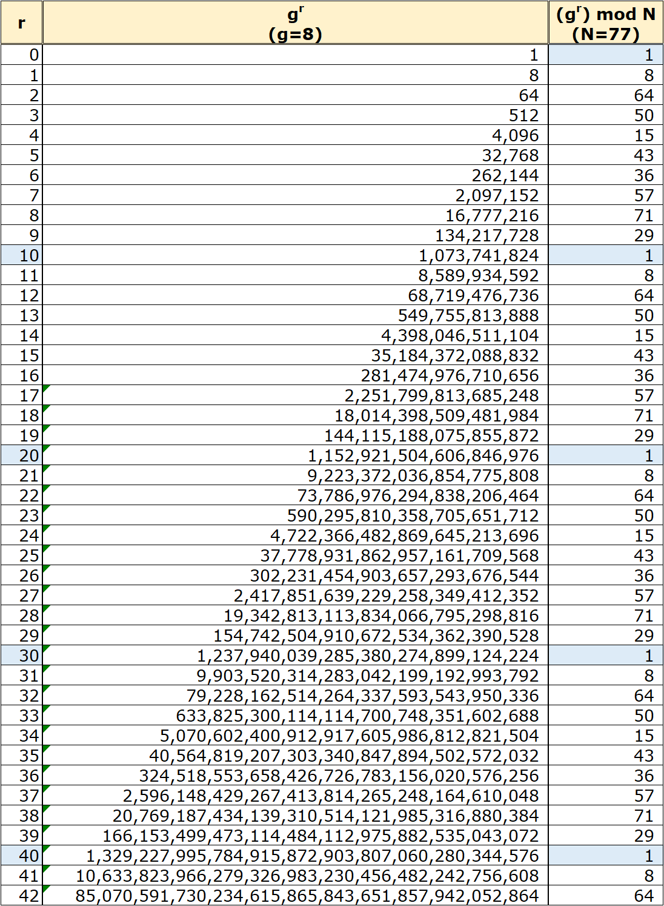

Note that since our example uses a very small number, we can do the iteration with such table above.
However, with a very large number such as the actual modulus $N$ which is a 2048 bits number, iteration method such as displayed above will take literal-forever to find any result at all.
This extreme processing time requirement is what makes computing Shor's Algorithm with traditional computer becomes not feasible, and what makes the requirement of Quantum Computer mandatory to break RSA.

Before we continue with next step, we need to check the $r$ value we found (the first occurrence, or the constant distance between $r$ values).
If $r$ is found to be an odd number, we need to restart from beginning and pick another/different $g$.
We can continue to next step only if $r$ is found to be an even number, which is the case with our example here ($r = 10$).

<br><br>

Once we got the correct $r$ value (i.e. even number), we'll use Euclid's Algorithm to calculate the Greatest Common Divisor (GCD) of:

- [ ] GCD of ${\color{red}((g^{\frac{r}{2}}) + 1)}$ and ${\color{red}N}$<br>
  GCD of ${\color{red}((8^{\frac{10}{2}}) + 1)}$ and ${\color{red}77}$<br>
  GCD of ${\color{red}32,769}$ and ${\color{red}77}$<br>

- [ ] GCD of ${\color{red}((g^{\frac{r}{2}}) - 1)}$ and ${\color{red}N}$<br>
  GCD of ${\color{red}((8^{\frac{10}{2}}) - 1)}$ and ${\color{red}77}$<br>
  GCD of ${\color{red}32,767}$ and ${\color{red}77}$<br>

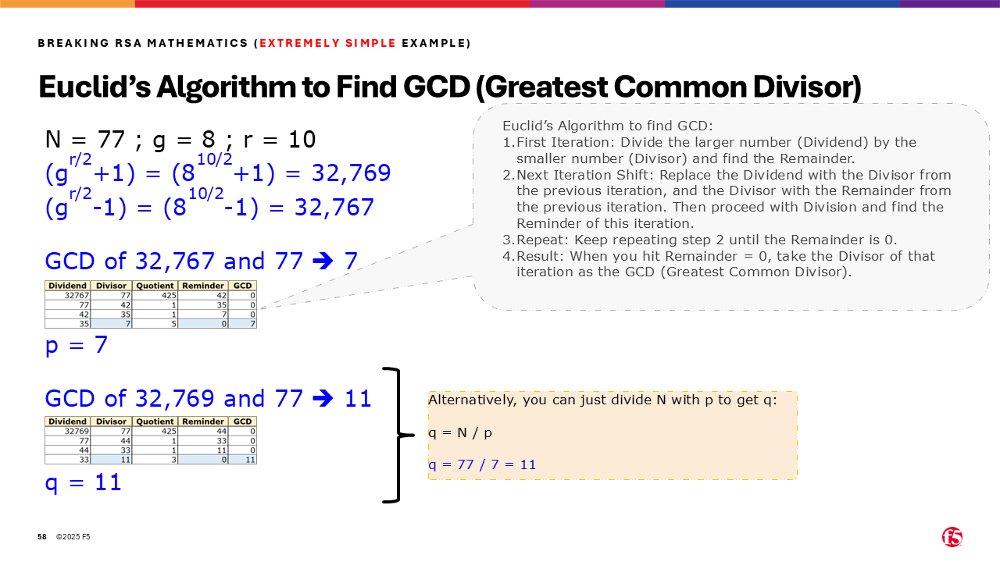

Euclid's Algorithm to find GCD:
- [ ] First Iteration: Divide the larger number (Dividend) by the smaller number (Divisor) and find the Remainder.
- [ ] Next Iteration Shift: Replace the Dividend with the Divisor from the previous iteration, and the Divisor with the Remainder from the previous iteration. Then proceed with Division and find the Reminder of this iteration.
- [ ] Repeat: Keep repeating step 2 (Next Iteration Shift) until the Remainder is 0.
- [ ] Result: When you hit Remainder = 0, take the Divisor of that iteration as the GCD (Greatest Common Divisor).

Let's try to find the GCD of ${\color{red}32,767}$ and ${\color{red}77}$ :

| $Dividend$ |        $Divisor$         | $Quotient$ |        $Reminder$         |      $GCD$       |
|-----------:|-------------------------:|-----------:|--------------------------:|-----------------:|
|   $32,767$ |                     $77$ |      $425$ |                      $42$ |              $0$ |
|       $77$ |                     $42$ |        $1$ |                      $35$ |              $0$ |
|       $42$ |                     $35$ |        $1$ |                       $7$ |              $0$ |
|       $35$ |${\color[rgb]{1,0.91,0}7}$|        $5$ |${\color[RGB]{255,233,0}0}$| ${\color{red}7}$ |

GCD of ${\color{red}32,767}$ and ${\color{red}77}$ is ${\color{red}7}$ .
Note that here the Euclid's Algorithm does NOT return $1$ or $N$; So we found one of the prime-number that is a factor of Modulus $N$, ${\color{red}p = 7}$ .

From this point, you have two options.
You can either use the newly found $p = 7$ value, by dividing $N$ with $p = 7$ to obtain $q$ :<br>
<br>
${\color{red}q = \frac{N}{p}}$<br>
<br>
${\color{red}q = \frac{77}{7}}$<br>
<br>
${\color{red}q = 11}$<br>

OR find the GCD of ${\color{red}32,769}$ and ${\color{red}77}$ using the Euclid's Algorithm:

| $Dividend$ |         $Divisor$         | $Quotient$ |        $Reminder$         |       $GCD$       |
|-----------:|--------------------------:|-----------:|--------------------------:|------------------:|
|   $32,769$ |                      $77$ |      $425$ |                      $44$ |               $0$ |
|       $77$ |                      $44$ |        $1$ |                      $33$ |               $0$ |
|       $44$ |                      $33$ |        $1$ |                      $11$ |               $0$ |
|       $33$ |${\color[rgb]{1,0.91,0}11}$|        $3$ |${\color[RGB]{255,233,0}0}$| ${\color{red}11}$ |

GCD of ${\color{red}32,769}$ and ${\color{red}77}$ is ${\color{red}11}$ .
Euclid's Algorithm does NOT return $1$ or $N$; So we found the other prime-number that is a factor of Modulus $N$, ${\color{red}q = 11}$ .

<br><br><br>

***

Once we can factor $N$ back to the two prime-numbers $p$ and $q$, the security mechanism of RSA starts to crumble like a house of cards.

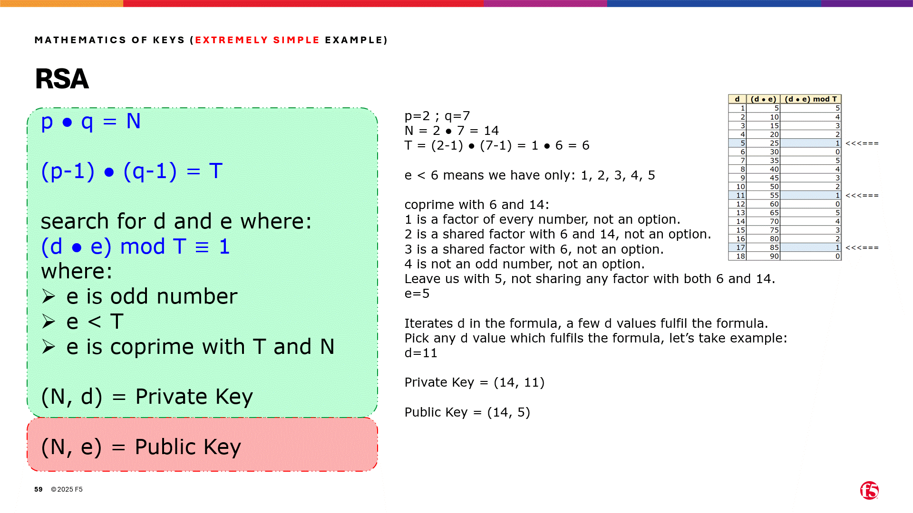

To depict the crumbling house of cards, we take context/illustration from previous [RSA Algorithm](https://github.com/gjwdyk/Article-TLS-RSA-High-Level-Simplified-Illustration#rsa-algorithm) section.
From the illustration, we can see:

- [ ] We obtain Modulus ${\color{red}N}$ information from the Public Key (or SSL/TLS Certificate).
- [ ] With steps above, we factor $N$ back to the two prime-numbers ${\color{red}p}$ and ${\color{red}q}$ .
- [ ] With $p$ and $q$ known, we can easily calculate Euler's Totient ${\color{red}T}$ .
- [ ] With Euler's Totient $T$ from the calculation, and Encryption Exponent ${\color{red}e}$ from the Public Key (or SSL/TLS Certificate), we can derive Decryption Exponent ${\color{red}d}$ .
- [ ] Even if we obtain multiple Decryption Exponent $d$ values, ANY of those can be used to do Decryption just fine.

As we can see above, once we can crack the Modulus $N$ back to the two prime-numbers $p$ and $q$, all the other secrets are just a matter of simple calculations.

<br><br><br>

***

## Quantum Computer

Above section describes the Algorithm to break RSA, and it is also stated that to break a real 2K RSA Key you'd need a Quantum Computer.
But what is a Quantum Computer?
Quite a lot of people have perception that Quantum Computer is just a far-better computer if compared to the computers we have today (let's call the computers we have today as "Traditional Computer").
However, in today's progress of Quantum Computer and the direction Quantum Computer is taking, Quantum Computer is more like ***specialized*** piece of hardware such as SSL/TLS Cards (emphasize on the word "specialized", the "SSL/TLS Card" is only as example), rather than a General Purpose Computer.
So it is save to make statement that Quantum Computer is NOT replacement for Traditional Computer as what we have today.
If you are looking for future replacement of current (traditional) CPU, Photonic CPU such as [Q.ANT](https://qant.com/) and/or [Akhetonics](https://www.akhetonics.com/) may be your better bet.

At the time of this document's writing, Quantum Computers are still in their infancies, they're not even mature enough to be of any usefulness to public nor even for extended researchers outside of quantum-related scientist-communities.
Also note that different people may have different view on quantum computer.
Some may have positive and enthusiastic views, some may have negative and pessimistic views.

Below are a few references of Quantum Computers developed by the giants of IT companies as of today:
- [ ] [Google's state-of-the-art quantum chip, Willow](https://blog.google/technology/research/google-willow-quantum-chip/)
- [ ] [IBM's quantum processors, Nighthawk](https://newsroom.ibm.com/2025-11-12-ibm-delivers-new-quantum-processors,-software,-and-algorithm-breakthroughs-on-path-to-advantage-and-fault-tolerance)
- [ ] [Microsoft’s quantum computing chip, Majorana 1](https://news.microsoft.com/source/features/innovation/microsofts-majorana-1-chip-carves-new-path-for-quantum-computing/)

Natural questions may occur such as: If quantum computer is not ready for practical uses as of now, then why the hype now?
It's because of "Store Now Decrypt Later" type of attack, where by third party in the middle between the Client and Server, wire-tapping and Storing the encrypted communication between client and server.
Although the third party can NOT read/obtain the plaintext message NOW, the third party can Decrypt the ciphertext LATER when the quantum computer is available (i.e. thus the name of the attack "Store Now Decrypt Later").
Some of data/information have a very long life time, that this type of attack is very valid.

Following up the above statement, Quantum Computer can be used to solve specific problems only (and it is very efficient in what it is doing), such in this case to solve Shor's Algorithm which help us break RSA.
Using Quantum Computer requires a completely different approach (i.e. require mathematical short-cuts), because the fundamental of how Quantum Computer works differs from traditional computer.

Imagine you are trying to find one of many exits from a giant, complex maze.
Traditional Computer acts like a mouse.
It runs down one path, hits a dead-end wall, turns around, and tries another path.
It eventually finds an exit, but it takes a long time because it explores one path at a time.
To find another exit, it needs to try the paths it has not explored before, and so on.
Quantum Computer acts like mist that enters the maze.
The mist flows down every possible paths at once.
It finds all the possible exits as well as the dead ends simultaneously.

To further compare between traditional computer and quantum computer, in traditional computer, you have Memory and CPU.
Memory holds data/value temporarily, while CPU computes/processes values into results/other values.
Quantum computer uses logical qubits as BOTH its Memory and CPU.
Logical qubits "holds" data/value in superposition, as well as "process" data/value into other value, through entanglement between those logical qubits.

Quantum Computer takes all possible input values in superposition,
and churn all possible output values also in superposition.
Superposition in this case means all possible values at the same time within the same logical qubits.
In that sense, reading the result would be similar to read one number from the display below, which is impossible:

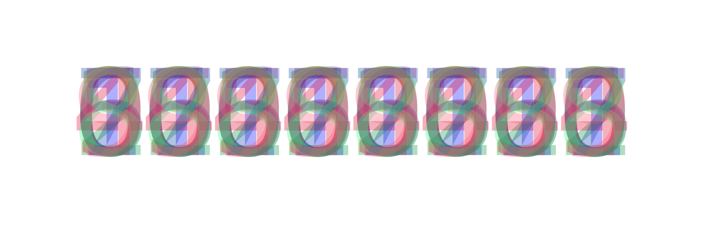

Therefore, some-kind of "filtering" is needed to "filter" the result which has all possible output values, into a result with just one value.
Note that the usage of the word "filter" as used above, is deemed to be "wrong".
But it is a better word to bring the understanding to common ordinary people.
The correct word used by quantum computer society would be "interference" or "to interfere" to amplify the correct answer while suppressing others.
This "filter"/"interference" is yet another Algorithm that needs to be developed and implemented.

To "filter" Shor's algorithm results, Quantum Fourier Transform (QFT) is used to amplify the correct answer and suppress others.
QFT filter actually looks for periodicity in the result, not the $r$ value which causes the formula result equals $1$.
It's just happens to be the first $r$ value is the same as the periodicity value.
To proof the point, refer back to the Shor's table above, we added $r = 0$ which automatically causes the formula results equals $1$.
That means the first $r$ value which causes the formula result equals $1$ (except $r = 0$) is exactly one period length (i.e. the value QFT is looking for).
That's why we take only the first $r$ occurrence, or the periodicity if you are able to find that, in our example above.

The issue with "filter"/"interference" however, that every problem that you want to solve may require different type of "filter"/"interference" algorithm.
And these "mathematical shortcut" (special algorithm to solve the problem) and "filter/interference" (special algorithm to "filter" the correct answer from all the possible values), these two algorithms are ones of the biggest hurdles in the usefulness of quantum computer.

Disregards to the above issues or hindrances that Quantum Computer society still need to solve, Quantum Computer is still a valid threat to traditional Asymmetric Encryption such as RSA.
In fact, some organizations adopt the forecasts of when quantum computer may be used to break 2K RSA Key, and do planning around the forecasts.
There are multiple types forecast that can be found; below are just examples:

- [ ] Forecast of when the supply of number of qubits can meet the requirement to be able to break RSA

  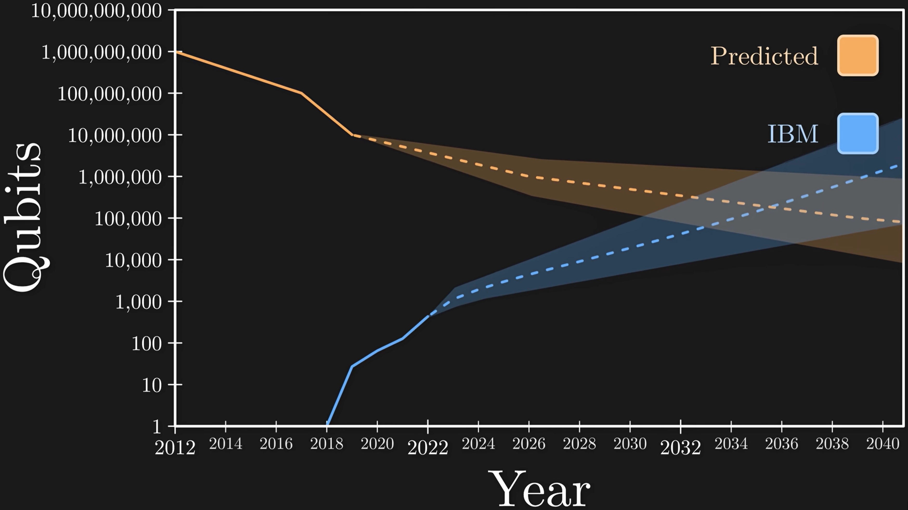

- [ ] Forecast of when certain qualities and/or features of quantum computer can be realized

  [](https://www.ibm.com/quantum/blog/ibm-quantum-roadmap-2025 "IBM Quantum Development Roadmap")

  [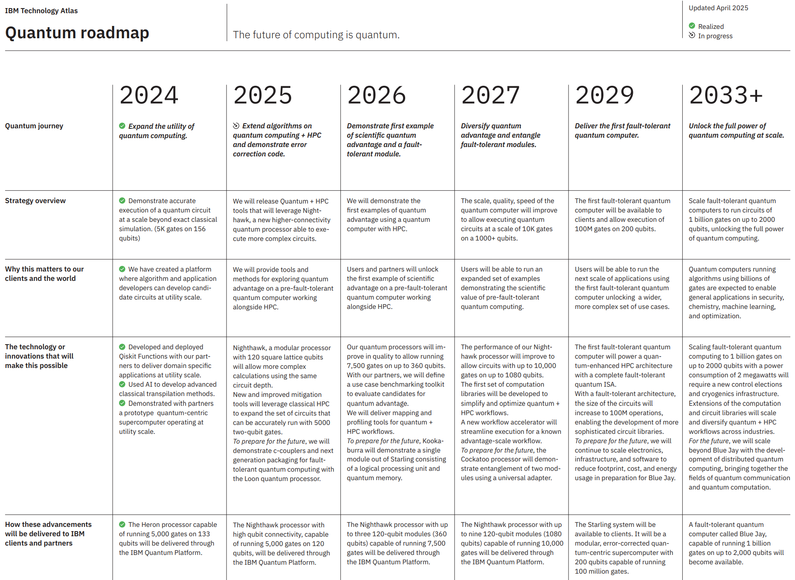](https://www.ibm.com/roadmaps/quantum.pdf "IBM Quantum Roadmap")

On the above sections, we described how Shor's Algorithm running on Quantum Computer can break RSA and other Asymmetric Cryptography, including Elliptic Curve Cryptography (ECC) and Diffie-Hellman key exchange.
Reference: [Shor’s Algorithm obsolete RSA, compromise ECC, and Diffie-Hellman key exchange](https://www.ssh.com/academy/nist-pqc-standards-explained-path-to-quantum-safe-encryption#:~:text=Shor's%20algorithm%20can%20factor%20large,and%20Diffie%2DHellman%20key%20exchange).
But how about Symmetric Cryptography?
Using Grover’s Algorithm running on Quantum Computer can weaken the security of Symmetric Algorithms.
Grover’s Algorithm effectively halves the security of symmetric keys and hash outputs. AES-128 offers approximately 64 bits of post-quantum security, while AES-256 provides an effective 128-bit post-quantum strength.
References: [Grover’s Algorithm: Speeding Up Brute Force](https://secureitconsult.com/quantum-computing-threatens-encryption/#:~:text=Grover%E2%80%99s%20Algorithm%3A%20Speeding%20Up%20Brute%20Force), [Advanced Encryption Standard (AES)](https://arxiv.org/html/2508.00832v1#:~:text=Grover%E2%80%99s%20algorithm%20reduces%20its%20effective%20security%20level).

<br><br><br>

***

## PQC's Lattice

Now that we know that current Asymmetric Algorithms will not be safe anymore in some short-distant future;
and sensitive data that are encrypted with the current Asymmetric Algorithms will be readable when Quantum Computer becomes available;
the obvious question will be: what actions to take?

National Institute of Standards and Technology (NIST) issued three (3) Federal Information Processing Standards (FIPS) standards:

- [ ] [NIST FIPS 203](https://doi.org/10.6028/NIST.FIPS.203), [Module-Lattice-Based Key-Encapsulation Mechanism Standard](https://nvlpubs.nist.gov/nistpubs/FIPS/NIST.FIPS.203.pdf) or [Local NIST FIPS 203 Copy](Document/NIST.FIPS.203.pdf)
- [ ] [NIST FIPS 204](https://doi.org/10.6028/NIST.FIPS.204), [Module-Lattice-Based Digital Signature Standard](https://nvlpubs.nist.gov/nistpubs/FIPS/NIST.FIPS.204.pdf) or [Local NIST FIPS 204 Copy](Document/NIST.FIPS.204.pdf)
- [ ] [NIST FIPS 205](https://doi.org/10.6028/NIST.FIPS.205), [Stateless Hash-Based Digital Signature Standard](https://nvlpubs.nist.gov/nistpubs/FIPS/NIST.FIPS.205.pdf) or [Local NIST FIPS 205 Copy](Document/NIST.FIPS.205.pdf)

Those three new FIPS standards are to anticipate the impending arrival of Quantum Computer, and also to try avoiding Store Now Decrypt Later (SNDL) attack today.
The three new FIPS standards (FIPS 203, FIPS 204, and FIPS 205) are what is called Post Quantum Cryptography (PQC).
They're basically replacement Algorithms to the current Asymmetric Algorithms, which the PQC Algorithms are stated to be resistant to the Quantum Computer.

The following remaining sections, we'll discuss about what is Lattice and how it is used in the Post Quantum Cryptography.
If you notice two out of three new FIPS standards (i.e. FIPS 203 and FIPS 204) are based on Lattice.
The Lattice discussion below will be more specific to FIPS 203 (Module-Lattice-Based Key-Encapsulation Mechanism), i.e. the encryption/decryption mechanism.
FIPS 203 is named "Key-Encapsulation Mechanism", because it is used to "encapsulate" (i.e. to encrypt) the Symmetric Key(s) (refer back to [SSL/TLS Protocol](https://github.com/gjwdyk/Article-TLS-RSA-High-Level-Simplified-Illustration#ssltls-protocol) for more context).

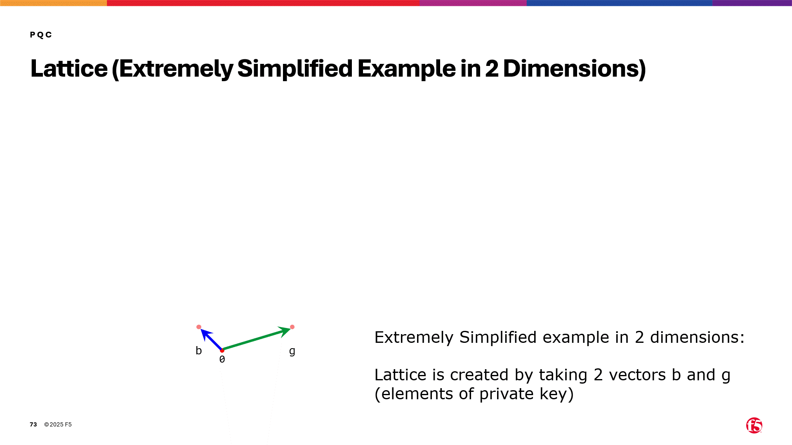

To make explanations easy to be understood, the illustration above is ***extremely*** simplified, and adopting humans' ability to imagine geometry, as well as adopting humans' ability to draw the illustration.
Therefore the illustration adopts a 2 dimensions space, while PQC algorithms use 512 or more dimensions which obviously will be a nightmare to be explained, will not be understood as well as impossible to be drawn in illustration.
Normal ordinary people even having hard time to imagine a 4 dimensions space, let alone 512 or more dimensions.

From the above 2 dimensions illustration, a lattice can be built from 2 vectors.
Note that the number 2 of vectors, comes from the number 2 of dimensions, they're related tightly.
If you combine all possible combinations of the two vectors, such as depicted in the illustration, you will get a lattice of all possible points that the two vectors can build.

Now let's pick a point $C$ near one of the lattice points.
With the blue and green vectors, what is the shortest path to go from origin point/point $0$ to the lattice point closest to point $C$?
With the blue and green vectors this task should be relatively easy, because the Lattice is composed by the blue and green vectors, so the blue and green vectors are like the grid units of the Lattice, similar like you do in a X-axis and Y-axis in [Cartesian Coordinate System](https://en.wikipedia.org/wiki/Cartesian_coordinate_system).

In PQC practice, the question "With the blue and green vectors, what is the shortest path to go from origin point/point $0$ to the lattice point closest to point $C$?" can be solved if you hold the PCQ's Private Key,
as you will learn later that blue and green vectors are components of Private Key.

However, if you were given different set of vectors, example from the illustration: orange vector and red vector, and have to answer the same question:
with the orange and red vectors, what is the shortest path to go from origin point/point $0$ to the lattice point closest to point $C$?
The answer with orange and red vectors is no longer straightforward as/if compared to the answer with blue and green vectors.

To proof the point about complexity in PQC algorithms, let's increase the dimensions just a bit to 3 dimensions in the illustration.
You will then have 3 vectors (orange vector, red vector, and violet vector) that you need to combine to build the (hopefully shortest) path to go from origin point/point $0$ to the lattice point closest to point $C$.
The complexity jumps exponentially more difficult; but that's still not all the complexity.
The points in the lattice are NOT given (or NOT known). You need to calculate them yourself if you need any of them.

So now you can start to imagine the complexity of the Lattice concept to answer the same question.
Given at least $n$ dimensions, where $n = 512$ or more (the standard PQC dictates the number of dimensions to be 512, 768 or 1024).
With the given set of $n$ vectors, what is the shortest path to go from origin point/point $0$ to the lattice point closest to point $C$ within the $n$ dimensions?
All the while you don't even know where the lattice points are.

To map the Lattice illustration back to our main topic;
- [ ] The blue and green vectors are called as "good vectors" and they're components of Private Key.
- [ ] All the points in the lattice are the messages universe (i.e. all the possible messages that can be transported through with the set of Public Key and Private Key we're about to calculate).
- [ ] Therefore the lattice point closest to point $C$ is the plaintext Message $M$ that we are trying to Encrypt/Decrypt.
- [ ] Note that the points in the lattice are NOT given (or NOT known). You need to calculate them yourself if you need. Just like our example.
- [ ] The point $C$ is the Ciphertext message.
- [ ] The orange and red vectors are called as "bad vectors" and they're components of Public Key.
- [ ] The "vector" from $M$ to $C$ is the introduced "Error(s)", which will be discussed later in algorithm called "Learning with Errors".

Further notes:
- [ ] The blue and green vectors are called "good vectors", when they're pointing in a relatively different directions. They're called "good vectors" because with the characteristic of "pointing in a relatively different directions" it is easier to arrive to the lattice point closest to point $C$.
- [ ] The orange and red vectors are called "bad vectors", when they're pointing relatively in the same direction, making it more difficult to arrive to the lattice point closest to point $C$.

<br><br>

You may think along the line:
If point $C$ is the Ciphertext I sniffed off the Internet or network somewhere, how difficult is it to find the Closest Lattice point $M$ (which is the plaintext Message)?
They're just close-neighbors anyway, right?
Let's try to follow, trace and answer that thought.

If we have one dimension lattice, and having Ciphertext point $C$ sit in/on the lattice somewhere, that point $C$ will have 2 neighboring lattice points.

<p align="center">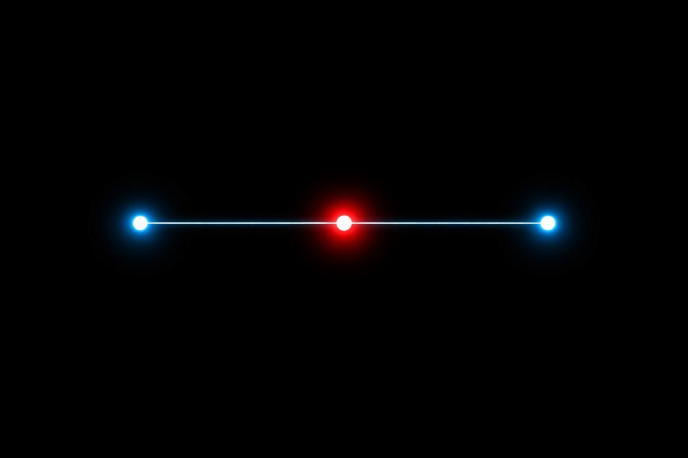</p>

If we have two dimensions lattice, and having Ciphertext point $C$ sit inside the lattice somewhere, that point $C$ will have 4 neighboring lattice points.

<p align="center">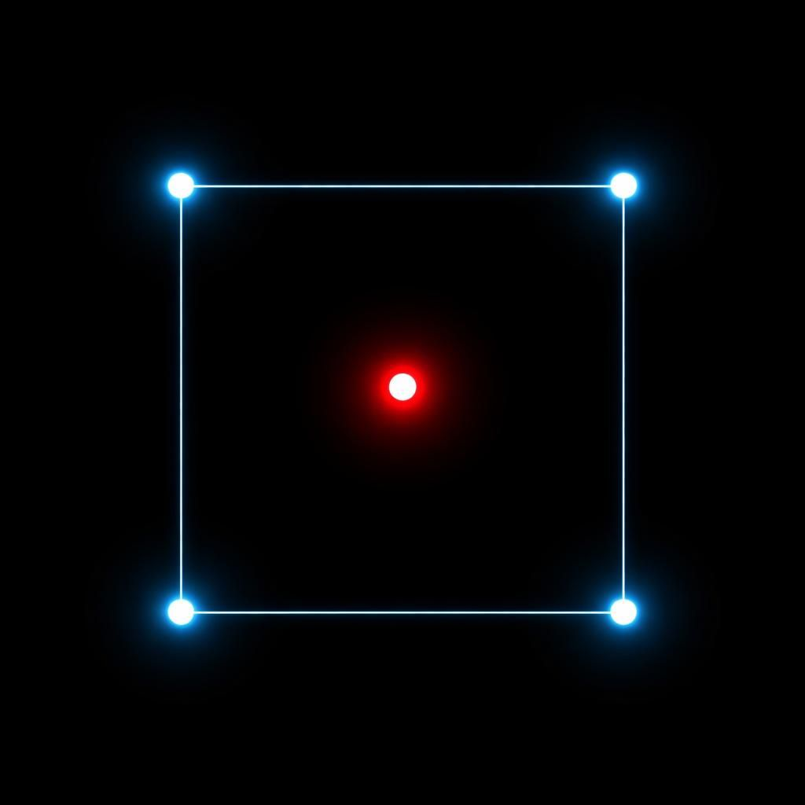</p>

If we have three dimensions lattice, and having Ciphertext point $C$ sit inside the lattice somewhere, that point $C$ will have 8 neighboring lattice points.

<p align="center">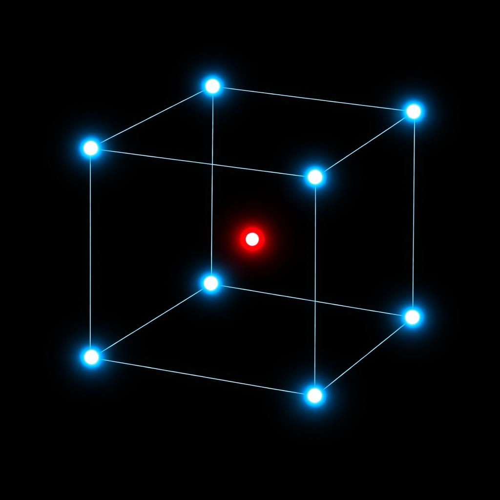</p>

With the pattern we have above, we can conclude that if we have $n$ dimensions lattice, point $C$ which sits somewhere inside the lattice will have ${\color{red}2^n}$ neighbors, which one of those neighbors is the point $M$ we are looking for.
With the PQC standards, the number of dimensions $n$ are standardized to be $512$, $768$ or $1024$.
Assuming $n = 512$, the amount of lattice-point-neighbors which we need to search through for a single point $M$, is $2^{512}$ (which is a 155-digits decimal integer).
The exact, full integer of $2^{512}$ is:

```math
{
13,407,807,929,942,597,099,574,024,998,205,846,127,479,365,820,592,393,377,723,561,443,721,764,030,073,546,976,801,874,298,166,903,427,690,031,858,186,486,050,853,753,882,811,946,569,946,433,649,006,084,096
}
```

To put this in perspective for search difficulties in Lattice-Based Cryptography:
If a computer could check one trillion lattice points every second, it would still take roughly $4 \times 10^{134}$ years to visit all "immediate"/neighboring surrounding points.
This is why "finding the closest vector" in a $n = 512$ dimensions lattice becomes computationally NOT feasible without specific keys or hints.
This difficulty is what forms the security backbone of PQC algorithms.

<br>

This concludes our high-level understanding about Lattice, what it is, and how complex it is to arrive at the lattice point $M$ (i.e. the plaintext Message) with a bad set of information.

<br><br><br>

***

## PQC's Learning with Errors (LwE)

Now that we grasp the concept of Lattice, how are we going to use Lattice concept to formulate Encryption/Decryption Algorithm?

As stated above, normal humans have limited imagination of 512 or more dimensions, and also limited capability to draw 512 or more dimensions.
And as computer works with numbers, logics, NOT drawings; and computer only does what humans can create the instructions.

This is where Learning with Errors (LwE) comes into the frame.
On the high-level correlations, we can state that Lattice is the geometry visualization for the current PQC algorithm, and LwE is the mathematical representations of the PQC algorithm.

As engineer, we may be familiar with Linear Equations/Linear Algebra, which in most cases we learned that in High School.
The Linear Equations/Linear Algebra can be solved with Gaussian Elimination with precision, as long as you have enough of the equations.
Simple example below, we have two equations with two variables:<br>
Equation 1: $1a + 1b = 5$<br>
Equation 2: $2a + 1b = 8$<br>

Change the first equation into:<br>
$1a + 1b = 5$<br>
$a = 5 - b$<br>
We got variable $a$ formula from first equation.

Then substitute variable $a$ in the second equation with the variable $a$ formula from first equation:<br>
$2a + 1b = 8$<br>
$2 (5 - b) + b = 8$<br>
$10 - 2b + b = 8$<br>
$10 - b = 8$<br>
$10 - 8 = b$<br>
$b = 2$<br>
We got value of variable $b = 2$.

Back to variable $a$ formula from first equation:<br>
$a = 5 - b$<br>
$a = 5 - 2$<br>
$a = 3$<br>
We got value of variable $a = 3$.

<br><br>

Now let's introduce Errors into the above Linear Equations/Linear Algebra example:<br>
Equation 1: $1a + 1b + e1 = 5$<br>
Equation 2: $2a + 1b + e2 = 8$<br>
<br>
Where:<br>
$e1 = -0.1$<br>
and<br>
$e2 = +0.2$<br>

Substitute the variable $e1$ and $e2$ with the assigned values above and simplify the equations:<br>
<br>
Equation 1: $1a + 1b - 0.1 = 5$<br>
Equation 1: $1a + 1b = 5 + 0.1$<br>
Equation 1: $1a + 1b = 5.1$<br>
<br>
Equation 2: $2a + 1b + 0.2 = 8$<br>
Equation 2: $2a + 1b = 8 - 0.2$<br>
Equation 2: $2a + 1b = 7.8$<br>

Change the first equation into:<br>
$1a + 1b = 5.1$<br>
$a = 5.1 - b$<br>
We got variable $a$ formula from first equation.

Then substitute variable $a$ in the second equation with the variable $a$ formula from first equation:<br>
$2a + 1b = 7.8$<br>
$2 (5.1 - b) + b = 7.8$<br>
$10.2 - 2b + b = 7.8$<br>
$10.2 - b = 7.8$<br>
$10.2 - 7.8 = b$<br>
$b = 2.4$<br>
We got value of variable $b = 2.4$.

Back to variable $a$ formula from first equation:<br>
$a = 5.1 - b$<br>
$a = 5.1 - 2.4$<br>
$a = 2.7$<br>
We got value of variable $a = 2.7$.

With Errors introduced, we got:<br>
$a = 2.7$<br>
$b = 2.4$<br>

But we know the actual values we are aiming for:<br>
$a = 3$<br>
$b = 2$<br>

This is where the word "Learning" (in "Learning with Errors") comes in.
When we know the distance of the discreet math we are adopting, we can do educated-guess/learning the result.
In our example, we use the round number or distance of discreet math as 1 whole integer.
Then we can educated-guess/learn (even with errors introduced into the equation), that:
- [ ] $a = 3$, because 2.7 is closer to 3 rather than 2;
- [ ] and $b = 2$, because 2.4 is closer to 2 rather than 3.

<br><br>

Back to Lattice and LwE relationship, below illustration is an attempt to depict the conversion of our Lattice example above into LwE mathematical representations:

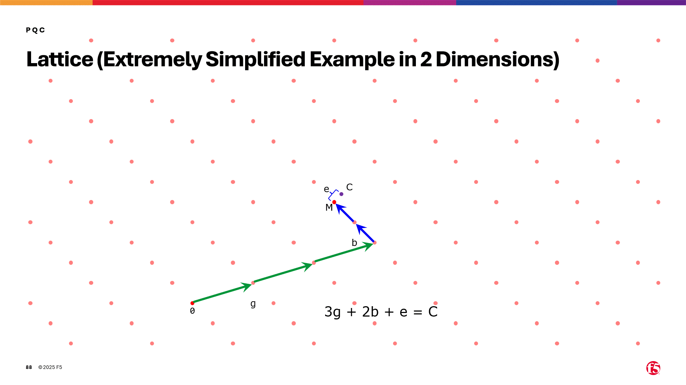

From the illustration, we can see that the path to go from origin point/point $0$ to point $C$:<br>
3 green vectors, plus 2 blue vectors, plus Error $e$ equals to $C$.<br>
Which can also be written mathematically as:

```math
{3g + 2b + e = C}
```

<br><br>

We break down each vector to their component (magnitude) in each dimension.
For example:
- [ ] the green vector is 3 units on ${\color[rgb]{0.5,0.5,0.5}x}$-axis and 1 unit on ${\color[RGB]{127,127,127}y}$-axis,
- [ ] the blue vector is -1 unit on ${\color[rgb]{0.5,0.5,0.5}x}$-axis and 1 unit on ${\color[RGB]{127,127,127}y}$-axis,
- [ ] and Error $e$ is 0.5 unit on ${\color[rgb]{0.5,0.5,0.5}x}$-axis and 0.5 unit on ${\color[RGB]{127,127,127}y}$-axis.

Which then we can write as:

```math
{3 ( 3{\color[rgb]{0.5,0.5,0.5}x} , 1{\color[RGB]{127,127,127}y} ) + 2 ( -1{\color[rgb]{0.5,0.5,0.5}x} , 1{\color[RGB]{127,127,127}y} ) + ( 0.5{\color[rgb]{0.5,0.5,0.5}x} , 0.5{\color[RGB]{127,127,127}y} ) = C}
```

<br><br>

The ${\color[rgb]{0.5,0.5,0.5}x}$ and ${\color[RGB]{127,127,127}y}$ serve only as indicator of which dimension it is related to.
The ${\color[rgb]{0.5,0.5,0.5}x}$ and ${\color[RGB]{127,127,127}y}$ indicator only help us when we started to learn about [Cartesian Coordinate System](https://en.wikipedia.org/wiki/Cartesian_coordinate_system) and they do not serve any other purposes.
With 512 or more dimensions, naming them one by one would be cumbersome and also making readability of the formula terrible.

We can get rid of the dimension's indicators and write the equation in matrix system such as below, where:
- [ ] the rows indicates the dimensions: first row is magnitudes of the vectors in first dimension, second row is magnitudes of the vectors in second dimension, and so on.
- [ ] the column indicates the vectors: the first column is all the components of the first vector, the second column is all the components of the second vector, and so on.

```math
{\begin{bmatrix} 3 & -1 \\ 1 & 1 \end{bmatrix} \cdot \begin{bmatrix} 3 \\ 2 \end{bmatrix} + \begin{bmatrix} 0.5 \\ 0.5 \end{bmatrix} = C}
```

<br><br>

Same as any other types mathematical equations, the matrix (with all the values in it) can be represented with a Variable, so explaining and discussing them can be simpler and easier:

```math
{A \cdot s + e = C}
```

where:
```math
{A = \begin{bmatrix} 3 & -1 \\ 1 & 1 \end{bmatrix}}
```

```math
{s = \begin{bmatrix} 3 \\ 2 \end{bmatrix}}
```

```math
{e = \begin{bmatrix} 0.5 \\ 0.5 \end{bmatrix}}
```

<br><br><br>

***

Let's start with how the PQC's algorithm defined.
Before we can do Encryption and Decryption, we need to create the Pair of Private Key and Public Key, such as defined below:

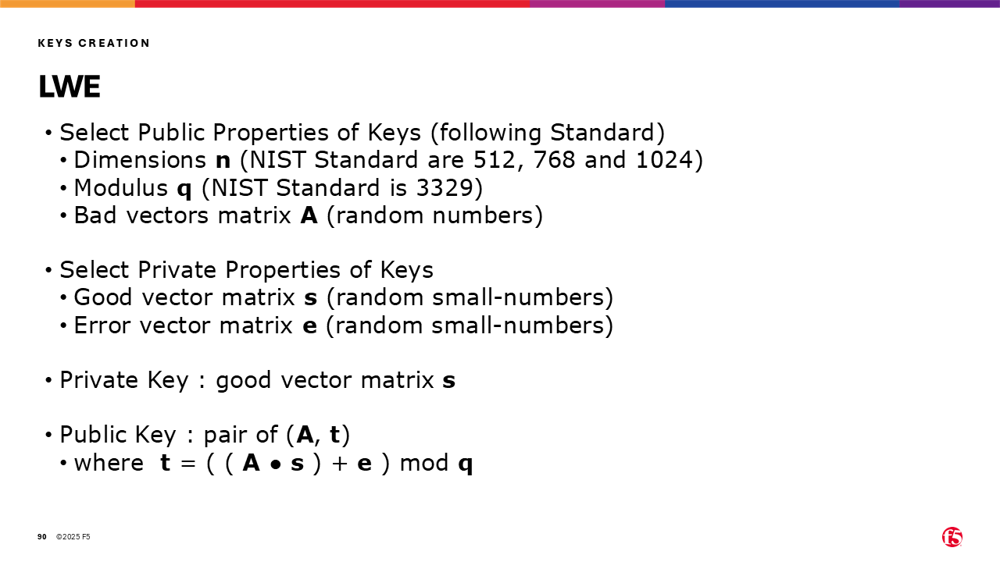

- [ ] Select Public Properties of Keys following Standard. These public properties are well known information/parameters which publicly available as part of standard.
  - [ ] Dimensions ${\color{red}n}$ (NIST Standard are 512, 768 and 1024)
  - [ ] Modulus ${\color{red}q}$ (NIST Standard is 3329)

- [ ] Select Public Properties of Keys. These information/parameters are specific for one particular Public Key.
  - [ ] Bad vectors matrix ${\color{red}A}$ (filled with random numbers)

- [ ] Select Private Properties of Keys. These information/parameters are specific for one particular Private Key, and must be kept secret.
  - [ ] Good vector matrix ${\color{red}s}$ (filled with random small-numbers)
  - [ ] Error vector matrix ${\color{red}e}$ (filled with random small-numbers)

- [ ] ***Private Key*** : good vector matrix ${\color{red}s}$

- [ ] ***Public Key*** : pair of ${\color{red}(A, t)}$
  - [ ] where  ${\color{red}t = ( ( A \cdot s ) + e ) \bmod q}$

Once we have the Private Key and Public Key, the sender can do encryption as defined below:

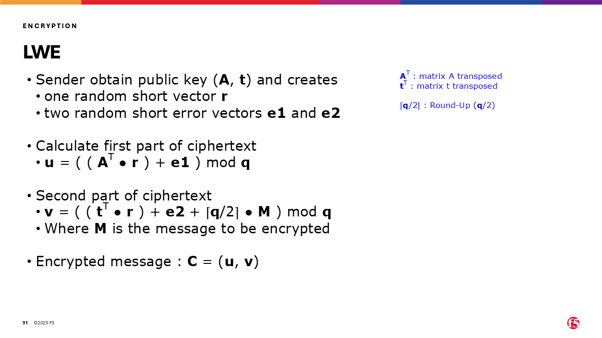

- [ ] Sender obtain public key ${\color{red}(A, t)}$ and creates
  - [ ] one random short vector ${\color{red}r}$
  - [ ] two random short error vectors ${\color{red}e1}$ and ${\color{red}e2}$

- [ ] Calculate first part of ciphertext as below
  - [ ] ${\color{red}u = ( ( A^T \cdot r ) + e1 ) \bmod q}$
  - [ ] Where ${\color{red}A^T}$ is matrix $A$ Transposed

- [ ] Calculate second part of ciphertext as below
  - [ ] ${\color{red}v = ( ( t^T \cdot r ) + e2 + ( \Bigl\lceil \frac{q}{2} \Bigr\rceil \cdot M ) ) \bmod q}$
  - [ ] Where ${\color{red}M}$ is the message to be encrypted
  - [ ] Where ${\color{red}\Bigl\lceil \frac{q}{2} \Bigr\rceil}$ is ${\frac{q}{2}}$ rounded UP
  - [ ] Where ${\color{red}t^T}$ is matrix $t$ Transposed

- [ ] ***Ciphertext*** (i.e. encrypted message) : ${\color{red}C = (u, v)}$

And the decryption process is defined as below:

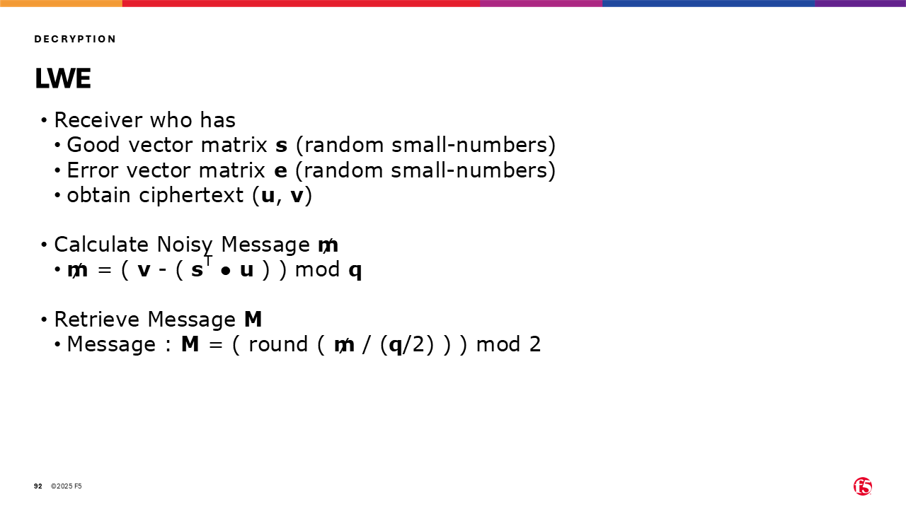

- [ ] Receiver who has:
  - [ ] Good vector matrix ${\color{red}s}$ (random small-numbers)
  - [ ] Error vector matrix ${\color{red}e}$ (random small-numbers)
  - [ ] obtained ciphertext ${\color{red}(u, v)}$

- [ ] Calculate Noisy Message ${\color{red}&#x20A5;}$ as below
  - [ ] ${\color{red}&#x20A5; = ( v - ( s^T \cdot u ) ) \bmod q}$

- [ ] Retrieve Message ${\color{red}M}$ as below
  - [ ] ***Message*** : ${\color{red}M = \biggl( round \Bigl( \frac{ &#x20A5; }{ \bigl( \frac{q}{2} \bigr) } \Bigr) \biggr) \bmod 2}$

<br><br><br>

***

Now that we got the "formula" of the PQC algorithm, let's try it with some simple example (small number of dimensions) to understand more on how those formula works.

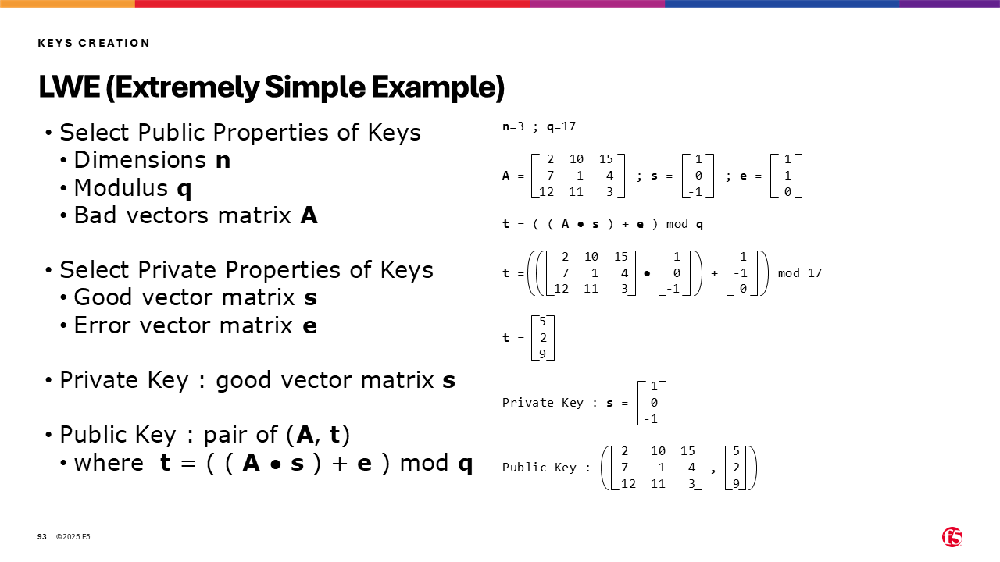

- [ ] For the public properties of Keys following standard, we take example:<br>
Dimensions ${\color{red}n} = 3$<br>
Modulus ${\color{red}q} = 17$<br>

- [ ] For the properties of Public Keys: Bad vectors matrix; we take example:
```math
{{\color{red}A} = \begin{bmatrix} 2 & 10 & 15 \\ 7 & 1 & 4 \\ 12 & 11 & 3 \end{bmatrix}}
```

- [ ] For the properties of Private Keys: Good vector matrix; we take example:
```math
{{\color{red}s} = \begin{bmatrix} 1 \\ 0 \\ -1 \end{bmatrix}}
```

- [ ] For the properties of Private Keys: Error vector matrix; we take example:
```math
{{\color{red}e} = \begin{bmatrix} 1 \\ -1 \\ 0 \end{bmatrix}}
```
<br><br>

With the information above, we calculate ${{\color{red}t} = ( ( A \cdot s ) + e ) \bmod q}$.
```math
{{\color{red}t} = \begin{pmatrix} \begin{pmatrix} \begin{bmatrix} 2 & 10 & 15 \\ 7 & 1 & 4 \\ 12 & 11 & 3 \end{bmatrix} \cdot \begin{bmatrix} 1 \\ 0 \\ -1 \end{bmatrix} \end{pmatrix} + \begin{bmatrix} 1 \\ -1 \\ 0 \end{bmatrix} \end{pmatrix} \bmod 17}
```

```math
{{\color{red}t} = \begin{bmatrix} 5 \\ 2 \\ 9 \end{bmatrix}}
```

<br>

Therefore:

- [ ] ***Private Key*** :
```math
{{\color{red}s} = \begin{bmatrix} 1 \\ 0 \\ -1 \end{bmatrix}}
```

- [ ] ***Public Key*** :
```math
{{\color{red}(A, t)} = \begin{pmatrix} \begin{bmatrix} 2 & 10 & 15 \\ 7 & 1 & 4 \\ 12 & 11 & 3 \end{bmatrix} , \begin{bmatrix} 5 \\ 2 \\ 9 \end{bmatrix} \end{pmatrix}}
```

<br><br>

Once we got the Private and Public Keys, we can start to try to do encryption with the Public Key.

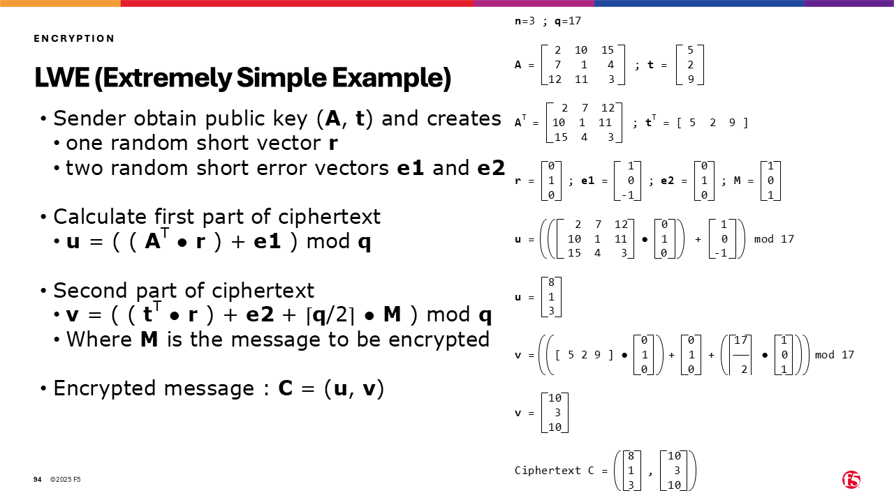

- [ ] The encrypted message sender who obtains public key ${\color{red}(A, t)}$ of the receiver creates one random short vector ${\color{red}r}$, example:
```math
{{\color{red}r} = \begin{bmatrix} 0 \\ 1 \\ 0 \end{bmatrix}}
```

- [ ] The sender also creates two random short error vectors ${\color{red}e1}$ and ${\color{red}e2}$, example:
```math
{{\color{red}e1} = \begin{bmatrix} 1 \\ 0 \\ -1 \end{bmatrix}}
```

```math
{{\color{red}e2} = \begin{bmatrix} 0 \\ 1 \\ 0 \end{bmatrix}}
```

- [ ] The sender calculates the first part of ciphertext ${{\color{red}u} = ( ( A^T \cdot r ) + e1 ) \bmod q}$.<br>
Where $A^T$ is matrix $A$ Transposed.

```math
{{\color{red}u} = \begin{pmatrix} \begin{pmatrix} \begin{bmatrix} 2 & 7 & 12 \\ 10 & 1 & 11 \\ 15 & 4 & 3 \end{bmatrix} \cdot \begin{bmatrix} 0 \\ 1 \\ 0 \end{bmatrix} \end{pmatrix} + \begin{bmatrix} 1 \\ 0 \\ -1 \end{bmatrix} \end{pmatrix} \bmod 17}
```

```math
{{\color{red}u} = \begin{bmatrix} 8 \\ 1 \\ 3 \end{bmatrix}}
```

- [ ] The sender also calculates second part of ciphertext ${{\color{red}v} = ( ( t^T \cdot r ) + e2 + ( \Bigl\lceil \frac{q}{2} \Bigr\rceil \cdot M ) ) \bmod q}$.<br>
Where $t^T$ is matrix $t$ Transposed.<br>
${\Bigl\lceil \frac{q}{2} \Bigr\rceil}$ is ${\frac{q}{2}}$ rounded up.<br>
And $M$ is the message to be encrypted.<br>
Example of $M$:

```math
{{\color{red}M} = \begin{bmatrix} 1 \\ 0 \\ 1 \end{bmatrix}}
```

```math
{{\color{red}v} = \begin{pmatrix} \begin{pmatrix} \begin{bmatrix} 5 & 2 & 9 \end{bmatrix} \cdot \begin{bmatrix} 0 \\ 1 \\ 0 \end{bmatrix} \end{pmatrix} + \begin{bmatrix} 0 \\ 1 \\ 0 \end{bmatrix} + \begin{pmatrix} \Bigl\lceil \frac{17}{2} \Bigr\rceil \cdot \begin{bmatrix} 1 \\ 0 \\ 1 \end{bmatrix} \end{pmatrix} \end{pmatrix} \bmod 17}
```

```math
{{\color{red}v} = \begin{bmatrix} 10 \\ 3 \\ 10 \end{bmatrix}}
```

- [ ] ***Ciphertext*** (i.e. encrypted message) ${{\color{red}C} = (u, v)}$

```math
{{\color{red}C} = \begin{pmatrix} \begin{bmatrix} 8 \\ 1 \\ 3 \end{bmatrix} , \begin{bmatrix} 10 \\ 3 \\ 10 \end{bmatrix} \end{pmatrix}}
```

<br><br>

To decrypt the ciphertext $C$.

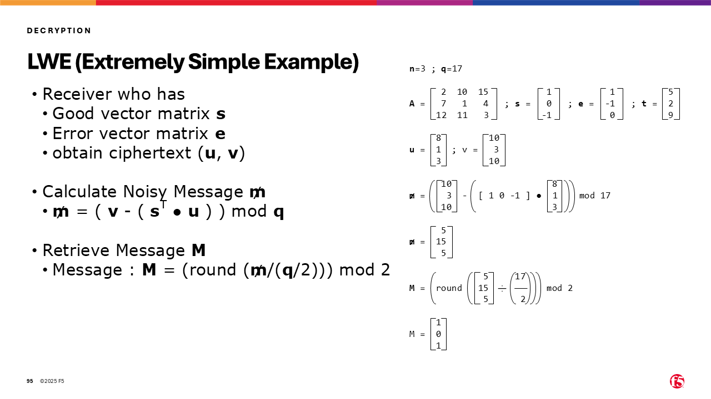

- [ ] The receiver who owns the Private Key ${\color{red}s}$, received the Ciphertext ${\color{red}(u, v)}$, calculates Noisy Message ${{\color{red}&#x20A5;} = ( v - ( s^T \cdot u ) ) \bmod q}$.

```math
{{\color{red}&#x20A5;} = \begin{pmatrix} \begin{bmatrix} 10 \\ 3 \\ 10 \end{bmatrix} - \begin{pmatrix} \begin{bmatrix} 1 & 0 & -1 \end{bmatrix} \cdot \begin{bmatrix} 8 \\ 1 \\ 3 \end{bmatrix} \end{pmatrix} \end{pmatrix} \bmod 17}
```

```math
{{\color{red}&#x20A5;} = \begin{bmatrix} 5 \\ 15 \\ 5 \end{bmatrix}}
```

- [ ] Then receiver retrieves the cleartext ***Message*** ${{\color{red}M} = \biggl( round \Bigl( \frac{ &#x20A5; }{ \bigl( \frac{q}{2} \bigr) } \Bigr) \biggr) \bmod 2}$.

```math
{{\color{red}M} = \begin{pmatrix} round \begin{pmatrix} \frac{ \begin{bmatrix} 5 \\ 15 \\ 5 \end{bmatrix} }{ \begin{pmatrix} \frac{17}{2} \end{pmatrix} } \end{pmatrix} \end{pmatrix} \bmod 2}
```

```math
{{\color{red}M} = \begin{bmatrix} 1 \\ 0 \\ 1 \end{bmatrix}}
```

We got our sample message $M$ back correctly.

<br><br><br>

***

Note on Message $M$. Suppose you're sending message "Hallo".

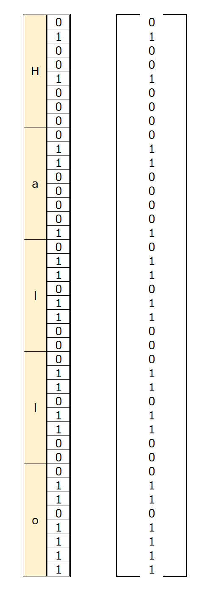

Line up all the characters/letters in correct order, and take the Binary values in the same order as a matrix of binary values.
With a 512 dimensions, the max length of message would be 512 bits, or 64 Bytes.

<br><br><br>

***

<br><br><br>
```
╔═╦═════════════════╦═╗
╠═╬═════════════════╬═╣
║ ║ End of Document ║ ║
╠═╬═════════════════╬═╣
╚═╩═════════════════╩═╝
```
<br><br><br>


